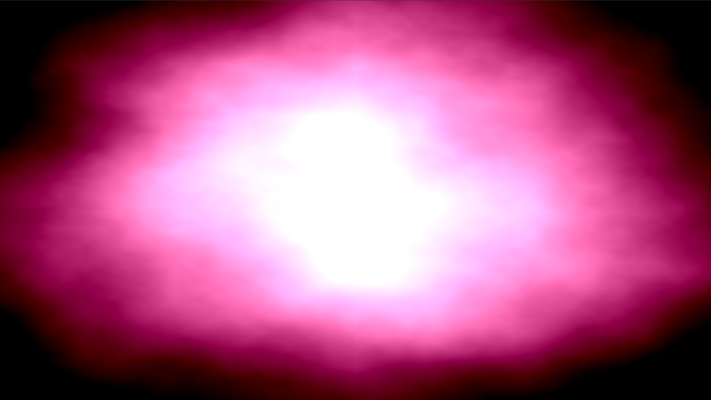

# Introduction

This project is a visualization of "Have a Dream" by Restive Plaggona. 
The visuals are created entirely in the fragment shader and are based on 
the FBM section of the [Book of 
Shaders](https://thebookofshaders.com/13/).

# Screenshot

# Installation

You will need openFrameworks to run this visualization but no addons are 
necessary. Simply put it in a subfolder of `apps` or wherever you have 
configured the projectGenerator to look for projects, run 
openFramework's projectGenerator, run `make`, and do `make run`. 
Alternatively, use QTCreator's openFramework's [Qt Creator 
plugin](https://openframeworks.cc/setup/qtcreator/).

# Usage

*   Space key: Start the music playback.
*   <kbd>→</kbd>: Jump 15 seconds forward.
*   <kbd>←</kbd>: Jump 15 seconds backward. 
*   <kbd>s</kbd> Stop the playback. 
*   <kbd>f</kbd>: Toggle fullscreen.

# Licence

This projected is licenced under GPLv3.
